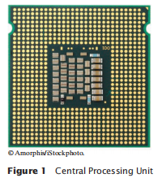
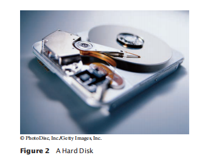
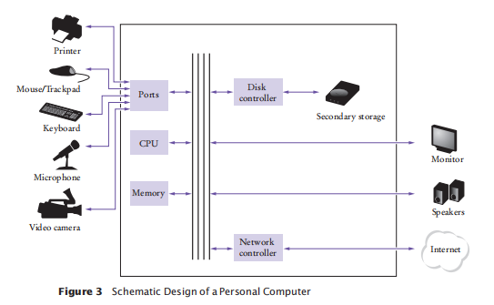
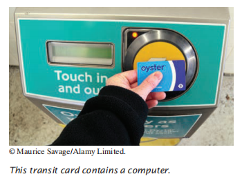
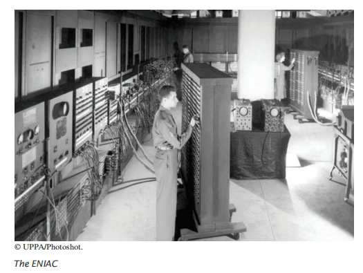
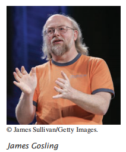
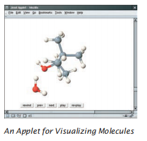

# **BIG JAVA**

# **1. INTRODUCTION**

_1. PENGANTAR_

## 1.1 Computer Programs

_1.1 Program Komputer_

You have probably used a computer for work or fun. Many people use computers for 
everyday tasks such as electronic banking or writing a term paper. Computers are 
good for such tasks. They can handle repetitive chores, such as totaling up numbers 
or placing words on a page, without getting bored or exhausted. 

_Anda mungkin pernah menggunakan komputer untuk bekerja atau bersenang-senang. Banyak orang menggunakan komputer untuk tugas sehari-hari seperti perbankan elektronik atau menulis makalah. Komputer bagus untuk tugas seperti itu. Mereka dapat menangani tugas-tugas yang berulang, seperti menjumlahkan angka atau menempatkan kata-kata di halaman, tanpa merasa bosan atau lelah._

The flexibility of a computer is quite an amazing phenomenon. The same machine 
can balance your checkbook, lay out your term paper, and play a game. In contrast, 
other machines carry out a much narrower range of tasks; a car drives and a toaster 
toasts. Computers can carry out a wide range of tasks because they execute different 
programs, each of which directs the computer to work on a specific task.

_Fleksibilitas komputer adalah fenomena yang cukup menakjubkan. Mesin yang sama dapat menyeimbangkan buku cek Anda, menyusun makalah Anda, dan bermain game. Sebaliknya, mesin lain melakukan tugas yang jauh lebih sempit; mobil drive dan pemanggang roti bersulang. Komputer dapat melakukan berbagai tugas karena mereka menjalankan program yang berbeda, yang masing-masing mengarahkan komputer untuk mengerjakan tugas tertentu._

The computer itself is a machine that stores data (numbers, words, pictures), inter
acts with devices (the monitor, the sound system, the printer), and executes programs. 
A **computer program** tells a computer, in minute detail, the sequence of steps that 
are needed to fulfill a task. The physical computer and peripheral devices are collec
tively called the **hardware**. The programs the computer executes are called the 
**software**. 

_Komputer itu sendiri adalah mesin yang menyimpan data (angka, kata, gambar), berinteraksi dengan perangkat (monitor, sound system, printer), dan menjalankan program. Sebuah **program komputer** memberitahu komputer, secara rinci, urutan langkah-langkah yang diperlukan untuk memenuhi tugas. Komputer fisik dan perangkat periferal secara kolektif disebut **perangkat keras**. Program yang dijalankan komputer disebut **perangkat lunak.**_

Today’s computer programs are so sophisticated that it is hard to believe that they 
are composed of extremely primitive instructions. A typical instruction may be one 
of the following:

_Program komputer saat ini sangat canggih sehingga sulit dipercaya bahwa mereka terdiri dari instruksi yang sangat primitif. Instruksi tipikal mungkin salah satu dari berikut ini:_

• Put a red dot at a given screen position. 

• Add up two numbers. 

• If this value is negative, continue the program at a certain instruction.

_• Letakkan titik merah pada posisi layar tertentu._

_• Jumlahkan dua angka._

_• Jika nilai ini negatif, lanjutkan program pada instruksi tertentu._

The computer user has the illusion of smooth interaction because a program contains 
a huge number of such instructions, and because the computer can execute them at 
great speed.

_Pengguna komputer memiliki ilusi interaksi yang lancar karena sebuah program berisi sejumlah besar instruksi seperti itu, dan karena komputer dapat mengeksekusinya dengan kecepatan tinggi._

The act of designing and implementing computer programs is called **program
ming**. In this book, you will learn how to program a computer—that is, how to direct 
the computer to execute tasks.

_Tindakan merancang dan mengimplementasikan program komputer disebut **pemrograman**. Dalam buku ini, Anda akan mempelajari cara memprogram komputer yaitu, cara mengarahkan komputer untuk menjalankan tugas._

To write a computer game with motion and sound effects or a word processor 
that supports fancy fonts and pictures is a complex task that requires a team of many 
highly-skilled programmers. Your first programming efforts will be more mundane. 
The concepts and skills you learn in this book form an important foundation, and 
you should not be disappointed if your first programs do not rival the sophis ticated 
software that is familiar to you. Actually, you will find that there is an immense thrill 
even in simple programming tasks. It is an amazing experience to see the computer 
precisely and quickly carry out a task that would take you hours of drudgery, to 
make small changes in a program that lead to immediate improvements, and to see the 
computer become an extension of your mental powers.

_Untuk menulis permainan komputer dengan efek gerakan dan suara atau pengolah kata yang mendukung font dan gambar mewah adalah tugas yang rumit yang membutuhkan tim yang terdiri dari banyak pemrogram yang sangat terampil. Upaya pemrograman pertama Anda akan lebih biasa. Konsep dan keterampilan yang Anda pelajari dalam buku ini membentuk landasan penting, dan Anda tidak perlu kecewa jika program pertama Anda tidak menyaingi perangkat lunak canggih yang sudah Anda kenal. Sebenarnya, Anda akan menemukan bahwa ada sensasi yang luar biasa bahkan dalam tugas pemrograman sederhana. Merupakan pengalaman yang luar biasa untuk melihat komputer dengan tepat dan cepat melakukan tugas yang akan menghabiskan waktu berjam-jam untuk Anda, membuat perubahan kecil dalam program yang mengarah pada perbaikan segera, dan melihat komputer menjadi perpanjangan dari kekuatan mental Anda._

## 1.2 The Anatomy of a Computer

_1.2 Anatomi Komputer_

To understand the programming process, you need to have a rudimentary under
standing of the building blocks that make up a computer. We will look at a personal 
computer. Larger computers have faster, larger, or more powerful components, but 
they have fundamentally the same design.

_Untuk memahami proses pemrograman, Anda harus memiliki pemahaman dasar tentang blok bangunan yang membentuk komputer. Kami akan melihat komputer pribadi. Komputer yang lebih besar memiliki komponen yang lebih cepat, lebih besar, atau lebih kuat, tetapi pada dasarnya mereka memiliki desain yang sama._

At the heart of the computer lies the **central 
processing unit (CPU)** (see Figure 1). The inside 
wiring of the CPU is enormously complicated. 
For example, the Intel Core processor (a popular 
CPU for personal computers at the time of this 
writing) is composed of several hundred million 
structural elements, called *transistors*.

_Di jantung komputer terletak **central processing unit (CPU)** (lihat Gambar 1). Pengkabelan bagian dalam CPU sangat rumit. Misalnya, prosesor Intel Core (CPU populer untuk komputer pribadi pada saat penulisan ini) terdiri dari beberapa ratus juta elemen struktural, yang disebut ***transistor***._



The CPU performs program control and data 
processing. That is, the CPU locates and exe
cutes the program instructions; it carries out 
arithmetic operations such as addition, subtrac
tion, multiplication, and division; it fetches data 
from external memory or devices and places 
processed data into storage. 

_CPU melakukan kontrol program dan pemrosesan data. Artinya, CPU menempatkan dan mengeksekusi instruksi program; itu melakukan operasi aritmatika seperti penambahan, pengurangan, perkalian, dan pembagian; itu mengambil data dari memori atau perangkat eksternal dan menempatkan data yang diproses ke dalam penyimpanan._

There are two kinds of storage. Primary storage, or memory, is made from electronic circuits that can store data, provided they are 
supplied with electric power. **Secondary storage**, usually a **hard disk** (see Figure 2) 
or a solid-state drive, provides slower and less expensive storage that persists without 
electricity. A hard disk consists of rotating platters, which are coated with a magnetic material. A solid-state drive uses electronic components that can retain information 
without power, and without moving parts.

_Ada dua macam penyimpanan. Penyimpanan primer, atau memori, dibuat dari sirkuit elektronik yang dapat menyimpan data, asalkan:
disuplai dengan tenaga listrik. ***Penyimpanan sekunder***, biasanya ***hard disk*** (lihat Gambar 2) atau solid-state drive, menyediakan penyimpanan yang lebih lambat dan lebih murah yang bertahan tanpa listrik. Sebuah hard disk terdiri dari piringan berputar, yang dilapisi dengan bahan magnetik. Solid-state drive menggunakan komponen elektronik yang dapat menyimpan informasi tanpa daya, dan tanpa bagian yang bergerak._



To interact with a human user, a computer requires peripheral devices. The com
puter transmits information (called *output*) to the user through a display screen, 
speakers, and printers. The user can enter information (called *input*) for the computer 
by using a keyboard or a pointing device such as a mouse.

_Untuk berinteraksi dengan pengguna manusia, komputer membutuhkan perangkat periferal. Komputer mengirimkan informasi (disebut ***output***) kepada pengguna melalui layar tampilan, speaker, dan printer. Pengguna dapat memasukkan informasi (disebut ***input***) untuk komputer dengan menggunakan keyboard atau perangkat penunjuk seperti mouse._

Some computers are self-contained units, whereas others are interconnected 
through *networks*. Through the network cabling, the computer can read data and 
programs from central storage locations or send data to other computers. To the user 
of a networked computer, it may not even be obvious which data reside on the com
puter itself and which are transmitted through the network. 

_Beberapa komputer adalah unit mandiri, sedangkan yang lain saling berhubungan melalui ***jaringan***. Melalui kabel jaringan, komputer dapat membaca data dan program dari lokasi penyimpanan pusat atau mengirim data ke komputer lain. Untuk pengguna komputer jaringan, bahkan mungkin tidak jelas data mana yang berada di komputer itu sendiri dan mana yang ditransmisikan melalui jaringan._

Figure 3 gives a schematic overview of the architecture of a personal computer. 
Program instructions and data (such as text, numbers, audio, or video) reside in sec
ondary storage or elsewhere on the network. When a program is started, its instruc
tions are brought into memory, where the CPU can read them. The CPU reads and 
executes one instruction at a time. As directed by these instructions, the CPU reads 
data, modifies it, and writes it back to memory or secondary storage. Some program 
instruc tions will cause the CPU to place dots on the display screen or printer or to 
vibrate the speaker. As these actions happen many times over and at great speed, the 
human user will perceive images and sound. Some program instructions read user 
input from the keyboard, mouse, touch sensor, or microphone. The program ana
lyzes the nature of these inputs and then executes the next appropriate instruction.

_Gambar 3 memberikan gambaran skematis arsitektur komputer pribadi. Instruksi dan data program (seperti teks, angka, audio, atau video) berada di penyimpanan sekunder atau di tempat lain di jaringan. Ketika sebuah program dimulai, instruksinya dibawa ke memori, di mana CPU dapat membacanya. CPU membaca dan mengeksekusi satu instruksi pada suatu waktu. Seperti yang diarahkan oleh instruksi ini, CPU membaca data, memodifikasinya, dan menulisnya kembali ke memori atau penyimpanan sekunder. Beberapa instruksi program akan menyebabkan CPU menempatkan titik-titik pada layar tampilan atau printer atau menggetarkan speaker. Karena tindakan ini terjadi berkali-kali dan dengan kecepatan tinggi, pengguna manusia akan melihat gambar dan suara. Beberapa instruksi program membaca input pengguna dari keyboard, mouse, sensor sentuh, atau mikrofon. Program menganalisis sifat input ini dan kemudian mengeksekusi instruksi berikutnya yang sesuai._




When computers were 
first invented in the 
1940s, a computer filled an entire 
room. The photo below shows the 
ENIAC (electronic numerical integrator 
and computer), completed in 1946 at 
the University of Pennsylvania. The 
ENIAC was used by the military to 
compute the trajectories of projectiles. 
Nowadays, computing facilities of 
search engines, Internet shops, and 
social networks fill huge buildings 
called data centers. At the other end of 
the spectrum, computers are all around 
us. Your cell phone has a computer 
inside, as do many credit cards and fare 
cards for public transit. A modern car 
has several computers––to control the 
engine, brakes, lights, and the radio. 

_Ketika komputer pertama kali ditemukan pada tahun 1940-an, komputer memenuhi seluruh ruangan. Foto di bawah menunjukkan ENIAC (integrator numerik elektronik dan komputer), selesai pada tahun 1946 di University of Pennsylvania. ENIAC digunakan oleh militer untuk menghitung lintasan proyektil. Saat ini, fasilitas komputasi mesin pencari, toko internet, dan jejaring sosial memenuhi gedung-gedung besar yang disebut pusat data. Di ujung lain spektrum, komputer ada di sekitar kita. Ponsel Anda memiliki komputer di dalamnya, seperti halnya banyak kartu kredit dan kartu tarif untuk angkutan umum. Mobil modern memiliki beberapa komputer––untuk mengontrol mesin, rem, lampu, dan radio._

The advent of ubiqui
tous computing changed 
many aspects of our 
lives. Factories used 
to employ people to 
do repetitive assembly 
tasks that are today car
ried out by computer
controlled robots, oper
ated by a few people 
who know how to 
work with those com
puters. Books, music, 
and movies nowadays 
are often consumed 
on computers, and 
computers are almost 
always involved in their production. 
The book that you are reading right 
now could not have been written with
out computers

_Munculnya komputasi di mana-mana mengubah banyak aspek
hidup. Pabrik dulu mempekerjakan orang untuk melakukan tugas perakitan berulang yang saat ini dilakukan oleh robot yang dikendalikan komputer, dioperasikan oleh beberapa orang yang tahu cara bekerja dengan komputer tersebut. Buku, musik, dan film saat ini sering dikonsumsi di komputer, dan komputer hampir selalu terlibat dalam produksinya. Buku yang Anda baca sekarang tidak mungkin ditulis tanpa komputer._



Knowing about computers and 
how to program them has become an 
essential skill in many careers. Engi
neers design computer-controlled cars 
and medical equipment that preserve 
lives. Computer scientists develop 
programs that help people come 
together to support social causes. For 
example, activists used social net
works to share videos showing abuse 
by repressive regimes, and this infor
mation was instrumental in changing 
public opinion.

_Mengetahui tentang komputer dan cara memprogramnya telah menjadi keterampilan penting dalam banyak karier. Insinyur merancang mobil yang dikendalikan komputer dan peralatan medis yang melestarikan kehidupan. Ilmuwan komputer mengembangkan program yang membantu orang berkumpul untuk mendukung tujuan sosial. Misalnya, para aktivis menggunakan jejaring sosial untuk berbagi video yang menunjukkan pelecehan oleh rezim yang represif, dan informasi ini berperan penting dalam mengubah opini publik._

As computers, large and small, 
become ever more embedded in 
our everyday lives, it is increasingly 
important for everyone to understand 
how they work, and how to work with 
them. As you use this book to learn 
how to program a computer, you will 
develop a good understanding of com
puting fundamentals that will make 
you a more informed citizen and, per
haps, a computing professional.

_Ketika komputer, besar dan kecil, menjadi semakin tertanam dalam kehidupan kita sehari-hari, semakin penting bagi setiap orang untuk memahami cara kerjanya, dan cara bekerja dengannya. Saat Anda menggunakan buku ini untuk mempelajari cara memprogram komputer, Anda akan mengembangkan pemahaman yang baik tentang dasar-dasar komputasi yang akan membuat Anda menjadi warga negara yang lebih berpengetahuan dan, mungkin, seorang profesional komputasi._



## 1.3 The Java Programming Language

_1.3 Bahasa Pemrograman Java_

In order to write a computer program, you need to provide a sequence of instructions 
that the CPU can execute. A computer program consists of a large number of simple 
CPU instructions, and it is tedious and error-prone to specify them one by one. For 
that reason, **high-level programming languages** have been created. In a high-level 
language, you specify the actions that your program should carry out. A **compiler** 
translates the high-level instructions into the more detailed instructions (called 
**machine code**) required by the CPU. Many different programming languages have 
been designed for different purposes. 


_Untuk menulis program komputer, Anda perlu memberikan urutan instruksi yang dapat dieksekusi oleh CPU. Sebuah program komputer terdiri dari sejumlah besar instruksi CPU sederhana, dan itu membosankan dan rawan kesalahan untuk menentukannya satu per satu. Untuk alasan itu, **bahasa pemrograman tingkat tinggi** telah dibuat. Dalam bahasa tingkat tinggi, Anda menentukan tindakan yang harus dilakukan program Anda. **Kompiler** menerjemahkan instruksi tingkat tinggi ke dalam instruksi yang lebih rinci (disebut **kode mesin**) yang dibutuhkan oleh CPU. Banyak bahasa pemrograman yang berbeda telah dirancang untuk tujuan yang berbeda._



In 1991, a group led by James Gosling and Patrick 
Naughton at Sun Microsystems designed a program
ming language, code-named “Green”, for use in con
sumer devices, such as intelligent television “set-top” 
boxes. The language was designed to be simple, secure, 
and usable for many different processor types. No cus
tomer was ever found for this technology.

_Pada tahun 1991, sebuah kelompok yang dipimpin oleh James Gosling dan Patrick Naughton di Sun Microsystems merancang bahasa pemrograman, dengan nama kode "Green", untuk digunakan dalam perangkat konsumen, seperti kotak "set-top" televisi cerdas. Bahasa ini dirancang agar sederhana, aman, dan dapat digunakan untuk berbagai jenis prosesor. Tidak ada pelanggan yang pernah ditemukan untuk teknologi ini._

Gosling recounts that in 1994 the team realized, 
“We could write a really cool browser. It was one of the 
few things in the client/server mainstream that needed 
some of the weird things we’d done: architecture neu
tral, real-time, reliable, secure.” Java was introduced to 
an enthusiastic crowd at the SunWorld exhibition in 
1995, together with a browser that ran **applets**—Java 
code that can be located anywhere on the Internet. 
The figure at right shows a typical example of an 
applet. 

_Gosling menceritakan bahwa pada tahun 1994 tim menyadari, “Kami dapat menulis browser yang sangat keren. Itu adalah salah satu dari sedikit hal dalam arus utama klien/server yang membutuhkan beberapa hal aneh yang telah kami lakukan: arsitektur netral, waktu nyata, andal, aman.” Java diperkenalkan kepada orang banyak yang antusias di pameran SunWorld pada tahun 1995, bersama dengan browser yang menjalankan **applet**—kode Java yang dapat ditemukan di mana saja di Internet. Gambar di sebelah kanan menunjukkan contoh khas applet._



Since then, Java has grown at a phenomenal rate. 
Programmers have embraced the language because 
it is easier to use than its closest rival, C++. In addi
tion, Java has a rich **library** that makes it possible 
to write portable programs that can bypass pro
prietary operating systems—a feature that was 
eagerly sought by those who wanted to be inde
pendent of those proprietary systems and was bit
terly fought by their vendors. A “micro edition” 
and an “enterprise edition” of the Java library 
allow Java programmers to target hardware ranging from smart cards to the largest 
Internet servers. 

_Sejak saat itu, Jawa tumbuh dengan kecepatan yang fenomenal. Pemrogram telah menggunakan bahasa ini karena lebih mudah digunakan daripada saingan terdekatnya, C++. Selain itu, Java memiliki **perpustakaan** yang kaya yang memungkinkan untuk menulis program portabel yang dapat melewati sistem operasi berpemilik—fitur yang sangat dicari oleh mereka yang ingin independen dari sistem berpemilik tersebut dan diperjuangkan dengan sengit oleh vendor mereka. "Edisi mikro" dan "edisi perusahaan" dari perpustakaan Java memungkinkan pemrogram Java untuk menargetkan perangkat keras mulai dari kartu pintar hingga server Internet terbesar._

| Table 1 Java Versions (since Version 1.0 in 1996) |
|:---------------------------------------------------:|

| Version | Year | Important New Features | Version | Year | Important New Features|
|:-------:|:-------:|:------------------------:|:---------:|:------:|:---------:|
 1.1 | 1997 | Inner classes | 6 | 2006 | Library improvements |
 1.2 | 1998 | Swing, Collections framework | 7 | 2011 | Small language changes and library improvements |
| 1.3 | 2000 | Performance enhancements | 8 | 2014 | Function expressions streams, new date/time library |
| 1.4 | 2002 | Assertions, XML support | 9 | 2017 | Modules |
| 5 | 2004 | Generic classes, enhanced for loop, auto-boxing, enumerations annotations | 10, 11 | 2018 | Versions with incremental improvements are released every six months |

Because Java was designed for the Internet, it has two attributes that make it very 
suitable for beginners: safety and portability. 

_Karena Java dirancang untuk Internet, ia memiliki dua atribut yang membuatnya sangat cocok untuk pemula: keamanan dan portabilitas._

Java was designed so that anyone can execute programs in their browser without 
fear. The safety features of the Java language ensure that a program is terminated if it 
tries to do something unsafe. Having a safe environment is also helpful for anyone 
learning Java. When you make an error that results in unsafe behavior, your program 
is terminated and you receive an accurate error report.

_Java dirancang agar siapa pun dapat menjalankan program di browser mereka tanpa rasa takut. Fitur keamanan bahasa Java memastikan bahwa program dihentikan jika mencoba melakukan sesuatu yang tidak aman. Memiliki lingkungan yang aman juga bermanfaat bagi siapa saja yang belajar Java. Ketika Anda membuat kesalahan yang mengakibatkan perilaku tidak aman, program Anda dihentikan dan Anda menerima laporan kesalahan yang akurat._

The other benefit of Java is portability. The same Java program will run, without 
change, on Windows, UNIX, Linux, or Macintosh. In order to achieve portability, 
the Java compiler does not translate Java programs directly into CPU instructions. 
Instead, compiled Java programs contain instructions for the Java **virtual machine**, a 
program that simulates a real CPU. Portability is another benefit for the begin ning 
student. You do not have to learn how to write programs for different platforms.

_Manfaat lain dari Java adalah portabilitas. Program Java yang sama akan berjalan, tanpa perubahan, di Windows, UNIX, Linux, atau Macintosh. Untuk mencapai portabilitas, kompiler Java tidak menerjemahkan program Java secara langsung ke dalam instruksi CPU. Sebaliknya, program Java yang dikompilasi berisi instruksi untuk ***mesin virtual*** Java, sebuah program yang mensimulasikan CPU nyata. Portabilitas adalah manfaat lain bagi siswa pemula. Anda tidak perlu belajar bagaimana menulis program untuk platform yang berbeda._

At this time, Java is firmly established as one of the most important languages for 
general-purpose programming as well as for computer science instruction. However, 
although Java is a good language for beginners, it is not perfect, for three reasons.

_Saat ini, Java telah ditetapkan sebagai salah satu bahasa yang paling penting untuk pemrograman tujuan umum serta untuk instruksi ilmu komputer. Namun, meskipun Java adalah bahasa yang baik untuk pemula, itu tidak sempurna, karena tiga alasan._

Because Java was not specifically designed for students, no thought was given to 
making it really simple to write basic programs. A certain amount of technical machin
ery is necessary to write even the simplest programs. This is not a problem for profes
sional programmers, but it can be a nuisance for beginning students. As you learn how 
to program in Java, there will be times when you will be asked to be satisfied with a 
preliminary explanation and wait for more complete detail in a later chapter.

_Karena Java tidak dirancang khusus untuk siswa, tidak ada pemikiran yang diberikan untuk membuatnya sangat sederhana untuk menulis program dasar. Sejumlah mesin teknis diperlukan untuk menulis bahkan program yang paling sederhana. Ini bukan masalah bagi programmer profesional, tetapi bisa menjadi gangguan bagi siswa pemula. Saat Anda mempelajari cara memprogram di Java, akan ada saatnya Anda akan diminta untuk puas dengan penjelasan awal dan menunggu detail yang lebih lengkap di bab selanjutnya._

Java has been extended many times during its life—see Table 1. In this book, we 
assume that you have Java version 8 or later.

_Java telah diperpanjang berkali-kali selama masa pakainya—lihat Tabel 1. Dalam buku ini, kami berasumsi bahwa Anda memiliki Java versi 8 atau yang lebih baru._

Finally, you cannot hope to learn all of Java in one course. The Java language itself 
is relatively simple, but Java contains a vast set of *library packages* that are required to 
write useful programs. There are packages for graphics, user-interface design, cryp
tography, networking, sound, database storage, and many other purposes. Even 
expert Java programmers cannot hope to know the contents of all of the packages— 
they just use those that they need for particular projects. 

_Akhirnya, Anda tidak dapat berharap untuk mempelajari semua bahasa Jawa dalam satu kursus. Bahasa Java itu sendiri relatif sederhana, tetapi Java berisi sekumpulan besar ***paket perpustakaan*** yang diperlukan untuk menulis program yang berguna. Ada paket untuk grafik, desain antarmuka pengguna, kriptografi, jaringan, suara, penyimpanan basis data, dan banyak tujuan lainnya. Bahkan
programmer Java ahli tidak dapat berharap untuk mengetahui isi dari semua paket yang mereka gunakan hanya yang mereka butuhkan untuk proyek tertentu._

Using this book, you should expect to learn a good deal about the Java language 
and about the most important packages. Keep in mind that the central goal of this 
book is not to make you memorize Java minutiae, but to teach you how to think 
about programming. 

_Dengan menggunakan buku ini, Anda diharapkan untuk belajar banyak tentang bahasa Java dan tentang paket-paket yang paling penting. Ingatlah bahwa tujuan utama dari buku ini bukanlah untuk membuat Anda menghafal hal-hal kecil Java, tetapi untuk mengajari Anda cara berpikir tentang pemrograman._

## 1.4 Becoming Familiar with Your  Programming Environment

_1.4 Menjadi Familiar dengan Lingkungan Pemrograman Anda_

-----

Many students find that the tools they need as programmers are very different from the 
software with which they are familiar. You should spend some time making yourself 
familiar with your programming environment. Because computer systems vary widely, 
this book can only give an outline of the steps you need to follow. It is a good idea to 
participate in a hands-on lab, or to ask a knowledgeable friend to give you a tour.

_Banyak siswa menemukan bahwa alat yang mereka butuhkan sebagai pemrogram sangat berbeda dari perangkat lunak yang mereka kenal. Anda harus meluangkan waktu untuk membiasakan diri dengan lingkungan pemrograman Anda. Karena sistem komputer sangat bervariasi, buku ini hanya dapat memberikan garis besar langkah-langkah yang perlu Anda ikuti. Merupakan ide bagus untuk berpartisipasi dalam lab praktik, atau meminta teman yang berpengetahuan luas untuk memberi Anda tur._

> Step 1 Start the Java development environment.

> _Langkah 1 Mulai lingkungan pengembangan Java._

Computer systems differ greatly in this regard. On many computers there is an **integrated development environment** in which you can write and test your programs. 

_Sistem komputer sangat berbeda dalam hal ini. Pada banyak komputer terdapat ***lingkungan pengembangan terintegrasi*** di mana Anda dapat menulis dan menguji program Anda._


On other computers you first launch an **editor**, a program that functions like a word 
processor, in which you can enter your Java instructions; you then open a console 
window and type commands to execute your program. You need to find out how to 
get started with your environment.

_Di komputer lain Anda pertama kali meluncurkan ***editor***, sebuah program yang berfungsi seperti pengolah kata, di mana Anda dapat memasukkan instruksi Java Anda; Anda kemudian membuka jendela konsol dan ketik perintah untuk menjalankan program Anda. Anda perlu mencari tahu bagaimana memulai dengan lingkungan Anda._

> Step 2 Write a simple program.

> _Langkah 2 Tulis program sederhana._

The traditional choice for the very first program in a new programming language is 
a program that displays a simple greeting: `“Hello, World!”`. Let us follow that tradi
tion. Here is the `“Hello, World!”` program in Java:

_Pilihan tradisional untuk program pertama dalam bahasa pemrograman baru adalah program yang menampilkan sapaan sederhana: `“Halo, Dunia!”`. Mari kita ikuti tradisi itu. Inilah `"Halo, Dunia!"` program di Java:_

```java

public class HelloPrinter 
{ 
    public static void main(String[] args) 
    { 
        System.out.println("Hello, World!"); 
    } 
}

```

We will examine this program in the next section. 

_Kami akan memeriksa program ini di bagian selanjutnya._

No matter which programming environment you use, you begin your activity by 
typing the program statements into an editor window. 

_Apa pun lingkungan pemrograman yang Anda gunakan, Anda memulai aktivitas Anda dengan mengetikkan pernyataan program ke dalam jendela editor._

Create a new file and call it HelloPrinter.java, using the steps that are appropriate 
for your environment. (If your environment requires that you supply a project name 
in addition to the file name, use the name hello for the project.) Enter the program 
instructions **exactly** as they are given above. Alternatively, locate the electronic copy 
in this book’s companion code and paste it into your editor.

_Buat file baru dan beri nama HelloPrinter.java, menggunakan langkah-langkah yang sesuai untuk lingkungan Anda. (Jika lingkungan Anda mengharuskan Anda memberikan nama proyek selain nama file, gunakan nama halo untuk proyek tersebut.) Masukkan instruksi program ***persis*** seperti yang diberikan di atas. Atau, temukan salinan elektronik dalam kode pendamping buku ini dan tempelkan ke editor Anda._

As you write this program, pay careful attention to the various symbols, and keep 
in mind that Java is **case sensitive**. You must enter upper- and lowercase letters exactly 
as they appear in the program listing. You cannot type MAIN or PrintLn. If you are not 
careful, you will run into problems—see Common Error 1.2. 

_Saat Anda menulis program ini, perhatikan baik-baik berbagai simbol, dan ingatlah bahwa Java **peka terhadap huruf besar-kecil**. Anda harus memasukkan huruf besar dan kecil persis seperti yang muncul dalam daftar program. Anda tidak dapat mengetik MAIN atau PrintLn. Jika Anda tidak hati-hati, Anda akan mengalami masalah—lihat Kesalahan Umum 1.2._


> Step 3  Run the program

> _Langkah 3 Jalankan program_

The process for running a program depends greatly on your programming environ
ment. You may have to click a button or enter some commands. When you run the 
test program, the message

_Proses untuk menjalankan program sangat bergantung pada lingkungan pemrograman Anda. Anda mungkin harus mengklik tombol atau memasukkan beberapa perintah. Saat Anda menjalankan program pengujian, pesannya_

```java
Hello, World!
```

will appear somewhere on the screen (see Figure 4 and Figure 5).

_akan muncul di suatu tempat di layar (lihat Gambar 4 dan Gambar 5)._

In order to run your program, the Java compiler translates your **source files** (that 
is, the statements that you wrote) into *class files*. (A class file contains instructions for 
the Java virtual machine.) After the compiler has translated your source code into 
virtual machine instructions, the virtual machine executes them. During execution, 
the virtual machine accesses a library of pre-written code, including the implementa
tions of the System and PrintStream classes that are necessary for displaying the 
program’s output. Figure 6 summarizes the process of creating and running a Java 
program. In some programming environments, the compiler and virtual machine are 
essentially invisible to the programmer—they are automatically executed whenever 
you ask to run a Java program. In other environments, you need to launch the com
piler and virtual machine explicitly. 

_Untuk menjalankan program Anda, kompiler Java menerjemahkan file sumber Anda (yaitu, pernyataan yang Anda tulis) ke dalam file kelas. (Sebuah file kelas berisi instruksi untuk mesin virtual Java.) Setelah kompilator menerjemahkan kode sumber Anda ke dalam instruksi mesin virtual, mesin virtual akan mengeksekusinya. Selama eksekusi,
mesin virtual mengakses perpustakaan kode pra-tertulis, termasuk implementasi kelas System dan PrintStream yang diperlukan untuk menampilkan output program. Gambar 6 merangkum proses membuat dan menjalankan program Java. Di beberapa lingkungan pemrograman, kompilator dan mesin virtual pada dasarnya tidak terlihat oleh pemrogram—mereka dijalankan secara otomatis setiap kali Anda meminta untuk menjalankan program Java. Di lingkungan lain, Anda perlu meluncurkan kompiler dan mesin virtual secara eksplisit._

> Step 4 Organize your work.

> _Langkah 4 Atur pekerjaan Anda._

As a programmer, you write programs, try them out, and improve them. You store 
your programs in files. Files are stored in folders or directories. A folder can contain 
files as well as other folders, which themselves can contain more files and folders (see 
Figure 7). This hierarchy can be quite large, and you need not be concerned with all of 
its branches. However, you should create folders for organizing your work. It is a 
good idea to make a separate folder for your programming coursework. Inside that folder, make a separate folder for each program.

_Sebagai seorang programmer, Anda menulis program, mencobanya, dan memperbaikinya. Anda menyimpan program Anda dalam file. File disimpan dalam folder atau direktori. Sebuah folder dapat berisi file serta folder lain, yang dengan sendirinya dapat berisi lebih banyak file dan folder (lihat Gambar 7). Hirarki ini bisa sangat besar, dan Anda tidak perlu khawatir dengan semua cabangnya. Namun, Anda harus membuat folder untuk mengatur pekerjaan Anda. Sebaiknya buat folder terpisah untuk kursus pemrograman Anda. Di dalam folder itu, buat folder terpisah untuk setiap program._


Some programming environments place your 
programs into a default location if you don’t spec
ify a folder yourself. In that case, you need to find 
out where those files are located.

_Beberapa lingkungan pemrograman menempatkan program Anda ke lokasi default jika Anda tidak menentukan folder sendiri. Dalam hal ini, Anda perlu mencari tahu di mana file-file itu berada._

Be sure that you understand where your files are 
located in the folder hierarchy. This information is 
essential when you submit files for grading, and for 
making backup copies (see Programming Tip 1.1).

_Pastikan Anda memahami di mana file Anda berada dalam hierarki folder. Informasi ini penting saat Anda mengirimkan file untuk penilaian, dan untuk membuat salinan cadangan (lihat Tip Pemrograman 1.1)._


-----
### **Programming Tip 1.1** 

_Tip Pemrograman 1.1_

----

**Backup Copies**

_Salinan Cadangan_

You will spend many hours creating and improving Java programs. 
It is easy to delete a file by accident, and occasionally files are lost 
because of a computer malfunction. Retyping the contents of lost 
files is frustrating and time-consuming. It is therefore crucially 
impor tant that you learn how to safeguard files and get in the habit 
of doing so before disaster strikes. Backing up files on a memory 
stick is an easy and convenient storage method for many people. Another increasingly popular 
form of backup is Internet file storage. 

_Anda akan menghabiskan banyak waktu untuk membuat dan meningkatkan program Java. Sangat mudah untuk menghapus file secara tidak sengaja, dan terkadang file hilang karena kerusakan komputer. Mengetik ulang konten file yang hilang membuat frustrasi dan memakan waktu. Oleh karena itu, sangatlah penting bagi Anda untuk mempelajari cara mengamankan file dan membiasakan diri melakukannya sebelum bencana terjadi. Mencadangkan file pada stik memori adalah metode penyimpanan yang mudah dan nyaman bagi banyak orang. Bentuk cadangan lain yang semakin populer adalah penyimpanan file Internet._

Here are a few pointers to keep in mind:

_Berikut adalah beberapa petunjuk yang perlu diingat:_

• Back up often. Backing up a file takes only a few seconds, and you will hate yourself if you 
have to spend many hours recreating work that you could have saved easily. I rec ommend 
that you back up your work once every thirty minutes.

_• Sering-seringlah membuat cadangan. Mencadangkan file hanya membutuhkan beberapa detik, dan Anda akan membenci diri sendiri jika harus menghabiskan banyak waktu untuk membuat ulang pekerjaan yang sebenarnya bisa Anda simpan dengan mudah. Saya sarankan Anda mencadangkan pekerjaan Anda setiap tiga puluh menit sekali._

• Rotate backups. Use more than one directory for backups, and rotate them. That is, first 
back up onto the first directory. Then back up onto the second directory. Then use the 
third, and then go back to the first. That way you always have three recent backups. If 
your recent changes made matters worse, you can then go back to the older version. 

_• Putar cadangan. Gunakan lebih dari satu direktori untuk cadangan, dan putar mereka. Artinya, backup dulu ke direktori pertama. Kemudian kembali ke direktori kedua. Kemudian gunakan yang ketiga, lalu kembali ke yang pertama. Dengan begitu Anda selalu memiliki tiga cadangan terbaru. Jika perubahan terbaru Anda memperburuk keadaan, Anda dapat kembali ke versi yang lebih lama._

• Pay attention to the backup direction. Backing up involves copying files from one place to 
another. It is important that you do this right—that is, copy from your work location to 
the backup location. If you do it the wrong way, you will overwrite a newer file with an 
older version.

_• Perhatikan arah pencadangan. Pencadangan melibatkan penyalinan file dari satu tempat ke tempat lain. Anda harus melakukannya dengan benar—yaitu, menyalin dari lokasi kerja Anda ke lokasi pencadangan. Jika Anda melakukannya dengan cara yang salah, Anda akan menimpa file yang lebih baru dengan versi yang lebih lama._

• Check your backups once in a while. Double-check that your backups are where you think 
they are. There is nothing more frustrating than to find out that the backups are not there 
when you need them. 

_• Periksa cadangan Anda sesekali. Periksa kembali apakah cadangan Anda berada di tempat yang Anda pikirkan. Tidak ada yang lebih membuat frustrasi daripada mengetahui bahwa cadangan tidak ada saat Anda membutuhkannya._

• Relax, then restore. When you lose a file and need to restore it from a backup, you are 
likely to be in an unhappy, nervous state. Take a deep breath and think through the 
recovery process before you start. It is not uncommon for an agitated computer user to 
wipe out the last backup when trying to restore a damaged file.

_• Santai, lalu pulihkan. Saat Anda kehilangan file dan perlu memulihkannya dari cadangan, kemungkinan besar Anda berada dalam keadaan gelisah dan tidak bahagia. Ambil napas dalam-dalam dan pikirkan proses pemulihan sebelum Anda mulai. Bukan hal yang aneh bagi pengguna komputer yang gelisah untuk menghapus cadangan terakhir ketika mencoba memulihkan file yang rusak._

----
----

## **1.5 Analyzing Your First Program**

_1.5 Menganalisis Program Pertama Anda_

----

In this section, we will analyze the first Java program in detail. Here again is the 
source code.

_Pada bagian ini, kita akan menganalisis program Java pertama secara rinci. Di sini lagi adalah kode sumber._


The line

_Garis_

```java
public class HelloPrinter
```

indicates the declaration of a class called HelloPrinter. 

_menunjukkan deklarasi kelas yang disebut HelloPrinter. _

Every Java program consists of one or more classes. We will discuss classes in more 
detail in Chapters 2 and 3.

_Setiap program Java terdiri dari satu atau lebih kelas. Kami akan membahas kelas secara lebih rinci di Bab 2 dan 3._

The word public denotes that the class is usable by the “public”. You will later 
encounter private fea tures.

_Kata publik menunjukkan bahwa kelas dapat digunakan oleh "publik". Anda kemudian akan menemukan fitur pribadi._

In Java, every source file can contain at most one public class, and the name of the 
public class must match the name of the file containing the class. For example, the 
class HelloPrinter must be contained in a file named `HelloPrinter.java`.

_Di Java, setiap file sumber dapat berisi paling banyak satu kelas publik, dan nama kelas publik harus sesuai dengan nama file yang berisi kelas tersebut. Misalnya, kelas HelloPrinter harus dimuat dalam file bernama `HelloPrinter.java.`_


The construction

Konstruksi

``` java
public static void main(String[] args) 
{ 
. . . 
}

```

declares a method called main. A method contains a collection of programming 
instructions that describe how to carry out a particular task. 

_mendeklarasikan metode yang disebut main. Metode berisi kumpulan instruksi pemrograman yang menjelaskan bagaimana melakukan tugas tertentu._

Every Java application must have a main method. Most Java programs contain 
other methods besides main, and you will see in Chapter 3 how to write other 
methods.

_Setiap aplikasi Java harus memiliki metode utama. Sebagian besar program Java berisi metode lain selain utama, dan Anda akan melihat di Bab 3 cara menulis metode lain._

The term static is explained in more detail in Chapter 8, and the meaning of 
String[] args is covered in Chapter 11. At this time, simply consider

_Istilah statis dijelaskan secara lebih rinci dalam Bab 8, dan arti dari String[ ] args dibahas dalam Bab 11. Pada saat ini, cukup pertimbangkan_

``` java

public class ClassName 
{ 
    public static void main(String[] args) 
    { 
        . . . 
    } 
} 

```


as a part of the “plumbing” that is required to create a Java program. Our first pro
gram has all instructions inside the main method of the class. 

_sebagai bagian dari "pipa" yang diperlukan untuk membuat program Java. Program pertama kami memiliki semua instruksi di dalam metode utama kelas._


The main method contains one or more instructions called statements. Each state
ment ends in a semicolon (;). When a program runs, the statements in the main method 
are executed one by one.

_Metode utama berisi satu atau lebih instruksi yang disebut pernyataan. Setiap pernyataan diakhiri dengan titik koma (;). Ketika sebuah program dijalankan, pernyataan dalam metode utama dieksekusi satu per satu._

In our example program, the main method has a single statement:

_Dalam program contoh kami, metode utama memiliki satu pernyataan:_

```java
System.out.println("Hello, World!");
```

This statement prints a line of text, namely `“Hello, World!”`. In this statement, we call 
a method which, for reasons that we will not explain here, is specified by the rather 
long name System.out.println

_Pernyataan ini mencetak sebaris teks, yaitu `“Halo, Dunia!”`. Dalam pernyataan ini, kami memanggil metode yang, untuk alasan yang tidak akan kami jelaskan di sini, ditentukan dengan nama System.out.println yang agak panjang._

We do not have to implement this method—the programmers who wrote the Java 
library already did that for us. We simply want the method to perform its intended 
task, namely to print a value.

_Kita tidak harus mengimplementasikan metode ini—programmer yang menulis library Java sudah melakukannya untuk kita. Kami hanya ingin metode melakukan tugas yang dimaksudkan, yaitu mencetak nilai._

Whenever you call a method in Java, you need to specify 

_Setiap kali Anda memanggil metode di Java, Anda perlu menentukan_

1. The method you want to use (in this case, `System.out.println`).

    _1. Metode yang ingin Anda gunakan (dalam hal ini, `System.out.println`)._

2. Any values the method needs to carry out its task (in this case, `"Hello, World!"`). 
The technical term for such a value is an argument. Arguments are enclosed in 
parentheses. Multiple arguments are separated by commas.

    _2.Nilai apa pun yang dibutuhkan metode untuk menjalankan tugasnya (dalam hal ini, `"Halo, Dunia!"`). Istilah teknis untuk nilai seperti itu adalah argumen. Argumen diapit dalam tanda kurung. Beberapa argumen dipisahkan dengan koma._

A sequence of characters enclosed in quotation marks

_Urutan karakter yang diapit tanda kutip_

```java
"Hello, World!" 
```

is called a string. You must enclose the contents of the string inside quotation marks 
so that the compiler knows you literally mean "Hello, World!". There is a reason for 
this requirement. Suppose you need to print the word main. By enclosing it in quota
tion marks, `"main"`, the compiler knows you mean the sequence of characters `m a i n`, 
not the method named main. The rule is simply that you must enclose all text strings in 
quotation marks, so that the compiler considers them plain text and does not try to 
inter pret them as program instructions.

_disebut string. Anda harus menyertakan isi string di dalam tanda kutip sehingga kompilator mengetahui maksud Anda secara harfiah "Halo, Dunia!". Ada alasan untuk persyaratan ini. Misalkan Anda perlu mencetak kata main. Dengan melampirkannya dalam tanda kutip, `"utama"`, kompiler tahu maksud Anda urutan karakter `m a i n`,
bukan metode bernama main. Aturannya sederhana, Anda harus menyertakan semua string teks dalam tanda kutip, sehingga kompilator menganggapnya sebagai teks biasa dan tidak mencoba menafsirkannya sebagai instruksi program._

You can also print numerical values. For example, the statement

_Anda juga dapat mencetak nilai numerik. Misalnya pernyataan_

```java
System.out.println(3 + 4);
```

evaluates the expression 3 + 4 and displays the number 7.

_mengevaluasi ekspresi 3 + 4 dan menampilkan angka 7._

Syntax 1.1 Java Program

_Sintaks 1.1 Program Java_


The System.out.println method prints a string or a number and then starts a new 
line. For example, the sequence of statements

_Metode `System.out.println` mencetak string atau angka dan kemudian memulai baris baru. Misalnya, urutan pernyataan_

``` java

System.out.println("Hello"); 
System.out.println("World!");

```

prints two lines of text:

_mencetak dua baris teks:_

``` java

Hello 
World!

```

There is a second method, System.out.print, that you can use to print an item without 
starting a new line. For example, the output of the two statements

_Ada metode kedua, System.out.print, yang dapat Anda gunakan untuk mencetak item tanpa memulai baris baru. Misalnya, output dari dua pernyataan_

```java

System.out.print("00"); 
System.out.println(3 + 4);

```

is the single line

_adalah garis tunggal_

```java

007

```

**EXAMPLE CODE** See sec05 of your eText or companion code for a program that demonstrates print commands. 

_***CONTOH KODE*** Lihat sec05 dari eText atau kode pendamping untuk program yang mendemonstrasikan perintah cetak._

----

### Common Error 1.1 

### _Kesalahan Umum 1.1_

**Omitting Semicolons**

_***Menghilangkan Titik Koma***_

In Java every statement must end in a semicolon. Forgetting to type a semicolon is a common 
error. It confuses the compiler, because the compiler uses the semicolon to find where one 
statement ends and the next one starts. The compiler does not use line breaks or closing braces 
to recognize the end of statements. For example, the compiler considers

_Di Java setiap pernyataan harus diakhiri dengan titik koma. Lupa mengetik titik koma adalah kesalahan umum. Ini membingungkan kompiler, karena kompiler menggunakan titik koma untuk menemukan di mana satu pernyataan berakhir dan yang berikutnya dimulai. Kompilator tidak menggunakan jeda baris atau kurung kurawal untuk mengenali akhir pernyataan. Misalnya, kompiler menganggap_

```java

System.out.println("Hello") 
System.out.println("World!");

```

a single statement, as if you had written

_satu pernyataan, seolah-olah Anda telah menulis_

```java

System.out.println("Hello") System.out.println("World!");

```


Then it doesn’t understand that statement, because it does not expect the word System follow
ing the closing parenthesis after "Hello"

_Kemudian tidak mengerti pernyataan itu, karena tidak mengharapkan kata Sistem mengikuti kurung penutup setelah "Halo"_

The remedy is simple. Scan every statement for a terminating semicolon, just as you would 
check that every English sentence ends in a period. However, do not add a semicolon at the 
end of public class Hello or public static void main. These lines are not statements.

_Obatnya sederhana. Pindai setiap pernyataan untuk mencari titik koma, sama seperti Anda akan memeriksa bahwa setiap kalimat bahasa Inggris diakhiri dengan tanda titik. Namun, jangan menambahkan titik koma di akhir public class Hello atau public static void main. Garis-garis ini bukan pernyataan._


----


## 1.6 Errors

_1.6 Kesalahan_

Experiment a little with the HelloPrinter program. What happens if you make a typing 
error such as

_Bereksperimenlah sedikit dengan program HelloPrinter. Apa yang terjadi jika Anda membuat kesalahan pengetikan seperti_

```java

System.ou.println("Hello, World!"); 
System.out.println("Hello, Word!");

```

In the first case, the compiler will complain. It will say that it has no clue what you 
mean by ou. The exact wording of the error message is dependent on your develop
ment environment, but it might be something like “Cannot find symbol ou”. This is a 
compile-time error. Something is wrong according to the rules of the language and 
the compiler finds it. For this reason, compile-time errors are often called syntax 
errors. When the compiler finds one or more errors, it refuses to translate the 
program into Java virtual machine instructions, and as a consequence you have no 
program that you can run. You must fix the error and compile again. In fact, the com
piler is quite picky, and it is common to go through several rounds of fixing compile
time errors before compilation succeeds for the first time.

_Dalam kasus pertama, kompiler akan mengeluh. Ini akan mengatakan bahwa ia tidak tahu apa yang Anda maksud dengan ou. Kata-kata yang tepat dari pesan kesalahan tergantung pada lingkungan pengembangan Anda, tetapi mungkin seperti "Tidak dapat menemukan simbol ou". Ini adalah kesalahan waktu kompilasi. Ada yang salah menurut aturan bahasa dan kompiler menemukannya. Untuk alasan ini, kesalahan waktu kompilasi sering disebut kesalahan sintaksis. Ketika kompilator menemukan satu atau lebih kesalahan, ia menolak untuk menerjemahkan program ke dalam instruksi mesin virtual Java, dan sebagai konsekuensinya Anda tidak memiliki program yang dapat dijalankan. Anda harus memperbaiki kesalahan dan mengkompilasi lagi. Faktanya, kompilator cukup pilih-pilih, dan adalah umum untuk melewati beberapa putaran memperbaiki kesalahan waktu kompilasi sebelum kompilasi berhasil untuk pertama kalinya._

If the compiler finds an error, it will not simply 
stop and give up. It will try to report as many 
errors as it can find, so you can fix them all at once. 

_Jika kompiler menemukan kesalahan, itu tidak akan berhenti dan menyerah begitu saja. Ini akan mencoba melaporkan kesalahan sebanyak yang dapat ditemukan, sehingga Anda dapat memperbaiki semuanya sekaligus._

Sometimes, an error throws the compiler 
off track. Suppose, for example, you forget the 
quotation marks around a string: System.out. 
println(Hello, World!). The compiler will not 
complain about the missing quotation marks. 
Instead, it will report “Cannot find symbol 
Hello”. Unfortunately, the compiler is not very 
smart and it does not realize that you meant to 
use a string. It is up to you to realize that you 
need to enclose strings in quotation marks. 

_Terkadang, kesalahan membuat kompiler keluar jalur. Misalkan, misalnya, Anda lupa tanda kutip di sekitar string: System.out.println(Hello, World!). Kompiler tidak akan mengeluh tentang tanda kutip yang hilang. Sebagai gantinya, itu akan melaporkan "Tidak dapat menemukan simbol Halo". Sayangnya, kompilernya tidak terlalu pintar dan tidak menyadari bahwa Anda bermaksud menggunakan string. Terserah Anda untuk menyadari bahwa Anda perlu menyertakan string dalam tanda kutip._


The error in the second line above is of a dif
ferent kind. The program will compile and run, 
but its output will be wrong. It will print

_Kesalahan pada baris kedua di atas adalah jenis yang berbeda. Program akan dikompilasi dan dijalankan, tetapi outputnya akan salah. Ini akan mencetak_

```java

Hello, Word!

```

This is a run-time error. The program is syntactically correct and does something, 
but it doesn’t do what it is supposed to do. Because run-time errors are caused by 
logical flaws in the program, they are often called logic errors.

_Ini adalah kesalahan run-time. Program ini secara sintaksis benar dan melakukan sesuatu, tetapi tidak melakukan apa yang seharusnya dilakukan. Karena kesalahan run-time disebabkan oleh kelemahan logis dalam program, mereka sering disebut kesalahan logika._

This particular run-time error did not include an error message. It simply pro
duced the wrong output. Some kinds of run-time errors are so severe that they gen
erate an exception: an error message from the Java virtual machine. For example, if 
your program includes the statement

_Kesalahan run-time khusus ini tidak menyertakan pesan kesalahan. Itu hanya menghasilkan output yang salah. Beberapa jenis kesalahan run-time sangat parah sehingga menghasilkan pengecualian: pesan kesalahan dari mesin virtual Java. Misalnya, jika program Anda menyertakan pernyataan_

```java

System.out.println(1 / 0);

```

you will get a run-time error message “Division by zero”.

_Anda akan mendapatkan pesan kesalahan run-time "Pembagian dengan nol"._

During program development, errors are unavoidable. Once a program is longer 
than a few lines, it would require superhuman concentration to enter it correctly 
without slipping up once. You will find yourself omitting semicolons or quotation 
marks more often than you would like, but the compiler will track down these prob
lems for you.

_Selama pengembangan program, kesalahan tidak dapat dihindari. Begitu sebuah program lebih panjang dari beberapa baris, itu akan membutuhkan konsentrasi manusia super untuk memasukkannya dengan benar tanpa tergelincir satu kali pun. Anda akan menemukan diri Anda menghilangkan titik koma atau tanda kutip lebih sering daripada yang Anda inginkan, tetapi kompilator akan melacak masalah ini untuk Anda._

Run-time errors are more troublesome. The compiler will not find them—in fact, 
the compiler will cheerfully translate any program as long as its syntax is correct— 
but the resulting program will do something wrong. It is the responsibility of the 
program author to test the program and find any run-time errors. 

_Kesalahan run-time lebih merepotkan. Kompilator tidak akan menemukannya—sebenarnya, kompilator akan dengan senang hati menerjemahkan program apa pun selama sintaksnya benar—tetapi program yang dihasilkan akan melakukan kesalahan. Ini adalah tanggung jawab pembuat program untuk menguji program dan menemukan kesalahan run-time._

**EXAMPLE CODE** See sec06 of your eText or companion code for three programs that illustrate errors.

_CONTOH KODE Lihat sec06 dari eText atau kode pendamping untuk tiga program yang menggambarkan kesalahan._

----

### Common Error 1.2 

### _Kesalahan Umum 1.2_

Misspelling Words

_Kata-kata yang salah eja_

If you accidentally misspell a word, then strange things may happen, and it may not always be 
completely obvious from the error messages what went wrong. Here is a good example of how 
simple spelling errors can cause trouble:

_Jika Anda secara tidak sengaja salah mengeja kata, maka hal-hal aneh mungkin terjadi, dan mungkin tidak selalu jelas dari pesan kesalahan apa yang salah. Berikut adalah contoh yang baik tentang bagaimana kesalahan ejaan sederhana dapat menyebabkan masalah:_

```java

public class HelloPrinter 
    { 
    public static void Main(String[] args) 
    { 
        System.out.println("Hello, World!"); 
    } 
}

```

This class declares a method called Main. The compiler will not consider this to be the same as 
the main method, because Main starts with an uppercase letter and the Java language is case sen
sitive. Upper- and lowercase letters are considered to be completely different from each other, 
and to the compiler Main is no better match for main than rain. The compiler will cheerfully 
compile your Main method, but when the Java virtual machine reads the compiled file, it will 
complain about the missing main method and refuse to run the program. Of course, the mes
sage “missing main method” should give you a clue where to look for the error.

_Kelas ini mendeklarasikan sebuah metode yang disebut Main. Kompiler tidak akan menganggap ini sama dengan metode utama, karena Main dimulai dengan huruf besar dan bahasa Java peka huruf besar/kecil. Huruf besar dan kecil dianggap benar-benar berbeda satu sama lain, dan bagi kompiler Main tidak lebih cocok untuk main daripada hujan. Kompiler akan dengan senang hati mengkompilasi metode Main Anda, tetapi ketika mesin virtual Java membaca file yang dikompilasi, ia akan mengeluh tentang metode utama yang hilang dan menolak untuk menjalankan program. Tentu saja, pesan "metode utama yang hilang" akan memberi Anda petunjuk di mana mencari kesalahan._

If you get an error message that seems to indicate that the compiler or virtual machine is on 
the wrong track, check for spelling and capitalization. If you misspell the name of a symbol 
(for example, ou instead of out), the compiler will produce a message such as “cannot find sym
bol ou”. That error message is usually a good clue that you made a spelling error.

_Jika Anda mendapatkan pesan kesalahan yang tampaknya menunjukkan bahwa kompiler atau mesin virtual berada di jalur yang salah, periksa ejaan dan kapitalisasi. Jika Anda salah mengeja nama simbol (misalnya, ou alih-alih keluar), kompilator akan menghasilkan pesan seperti "tidak dapat menemukan sym bol ou". Pesan kesalahan itu biasanya merupakan petunjuk bagus bahwa Anda membuat kesalahan ejaan._

----

## 1.7 Problem Solving: Algorithm Design

_1.7 Pemecahan Masalah: Desain Algoritma_

----
Anda akan segera belajar bagaimana memprogram perhitungan dan pengambilan keputusan di Java. Tetapi sebelum kita melihat mekanisme penerapan perhitungan di bab berikutnya, mari kita pertimbangkan bagaimana Anda dapat menjelaskan langkah-langkah yang diperlukan untuk menemukan solusi dari suatu masalah.

### 1.7.1 Konsep Algoritma


Anda mungkin telah menemukan iklan yang mendorong Anda untuk membayar layanan terkomputerisasi mencocokkan Anda dengan pasangan cinta. Memikirkan bagaimana ini bisa berhasil. Anda mengisi formulir dan kirimkan. Yang lain melakukan hal yang sama. Data diproses oleh program komputer. Apakah masuk akal untuk asumsikan bahwa komputer dapat melakukan tugasmenemukan pasangan terbaik untuk Anda? Misalkan Anda adik laki-laki, bukan komputer, memiliki semua formulir di mejanya. Instruksi apa yang bisa Anda berikan? memberinya? Anda tidak bisa mengatakan, “Temukan yang paling tampan orang yang suka inline skating dan browsing internet”. Tidak ada standar objektif untuk ketampanan, dan pendapat saudaramu (atau itu program komputer yang menganalisis foto calon mitra) kemungkinan akan berbeda dari milik Anda. Jika Anda tidak dapat memberikan instruksi tertulis kepada seseorang untuk menyelesaikannya masalah, tidak mungkin komputer secara ajaib dapat menemukan solusi yang tepat. Itu komputer hanya dapat melakukan apa yang Anda perintahkan. Itu hanya melakukannya lebih cepat, tanpa mendapatkan bosan atau lelah.

Oleh karena itu, layanan pembuatan jodoh yang terkomputerisasi tidak dapat menjamin untuk menemukanpasangan yang optimal untuk Anda. Sebagai gantinya, Anda mungkin disajikan dengan serangkaian calon mitra yang memiliki minat yang sama dengan Anda. Itu adalah tugas yang program computer dapat memecahkan.

Agar program komputer memberikan jawaban atas masalah yang menghitung

jawaban, itu harus mengikuti urutan langkah-langkah yang

- Jelas

- Dapat dijalankan

- Mengakhiri

Urutan langkah tidak ambigu ketika ada instruksi yang tepat tentang apa yang harus dilakukan pada setiap langkah dan kemana harus pergi selanjutnya. Tidak ada ruang untuk menebak atau pendapat pribadi. Sebuah langkah dapat dieksekusi ketika itu dapat dilaksanakan dalam praktek. Misalnya, komputer dapat mencantumkan semua orang yang memiliki hobi yang sama dengan Anda, tapi itu tidak bisa memprediksi siapa yang akan menjadi pasangan seumur hidup Anda. Akhirnya, urutan langkah berakhir jika pada akhirnya akan berakhir. Sebuah program yang terus bekerja tanpa memberikan jawaban adalah jelas tidak berguna.


Urutan langkah yang tidak ambigu, dapat dieksekusi, dan diakhiri disebut algoritma. Meskipun tidak ada algoritme untuk menemukan pasangan, banyak masalah memiliki algoritme untuk diselesaikan mereka. Bagian berikutnya memberikan contoh. 

### 1.7.2 Algoritma untuk Memecahkan Masalah Investasi

----

Pertimbangkan masalah investasi berikut:

Anda memasukkan $10.000 ke dalam rekening bank yang menghasilkan bunga 5 persen per tahun. Berapa banyak tahun yang diperlukan agar saldo akun menjadi dua kali lipat dari aslinya?

Bisakah Anda memecahkan masalah ini dengan tangan? Tentu, Anda bisa. Anda mengetahui keseimbangannya sebagai berikut:


Anda terus berjalan sampai saldo setidaknya $20.000. Kemudian angka terakhir di tahun inikolom adalah jawabannya.

Tentu saja, melakukan perhitungan ini sangat membosankan bagi Anda atau adik laki-laki Anda. Tetapi komputer sangat pandai melakukan perhitungan berulang dengan cepat dan tanpa cacat. Yang penting bagi komputer adalah deskripsi langkah-langkah untuk menemukan solusi. Setiap langkah harus jelas dan tidak ambigu, tidak memerlukan tebak-tebakan. Berikut adalah deskripsi seperti itu:

Setel tahun ke 0, saldo ke 10.000.


Ketika saldo kurang dari $20,000

- Tambahkan 1 ke tabel tahun.

- Tetapkan bunga ke saldo x 0,05 (yaitu, bunga 5 persen).

- Tambahkan bunga ke saldo


Laporan tahun sebagai jawabannya.

Langkah-langkah ini termasuk dalam bahasa yang belum dapat dipahami oleh komputer, tapi kamu akan segera belajar bagaimana merumuskannya dalam Java. Deskripsi ini disebut dengan pseudocode. Kami membahas aturan untuk menulis pseudocode di bagian selanjutnya.

### 1.7.3 Pseudocode

----

Tidak ada persyaratan ketat untuk pseudocode karena dibaca oleh manusia,bukan program komputer. Berikut adalah jenis-jenis pernyataan pseudocode dan bagaimana kita akan menggunakan penerapannya dalam buku ini:

Gunakan pernyataan seperti berikut ini untuk menjelaskan bagaimana suatu nilai ditetapkan atau diubah:

    biaya total = harga beli + biaya operasi
    
    Kalikan nilai saldo dengan 1,05.
    
    Hapus karakter pertama dan terakhir dari kata.

Jelaskan keputusan dan pengulangan sebagai berikut:

    Jika total biaya 1 < total biaya 2

    Ketika saldo kurang dari $20,000

    Untuk setiap gambar dalam urutan

Gunakan lekukan untuk menunjukkan pernyataan mana yang harus dipilih atau diulang:

    Untuk setiap mobil

        biaya operasi = 10 x biaya bahan bakar tahunan

        biaya total = harga beli + biaya operasi

Di sini, lekukan menunjukkan bahwa kedua pernyataan harus dieksekusi untuk setiap mobil.

Tunjukkan hasil dengan pernyataan seperti:

    Pilih mobil1.

    Laporkan tahun sebagai jawabannya.


### 1.7.4 Dari Algoritma ke Program

----


Di Bagian 1.7.2, kami mengembangkan pseudocode untuk menemukan berapa lama waktu yang dibutuhkan untuk menggandakan investasi. Mari kita periksa kembali bahwa pseudocode mewakili suatu algoritma itu . adalah bahwa pseudocode itu jelas, dapat dieksekusi, dan diakhiri.

Pseudocode kami jelas. Ini hanya memberi tahu cara memperbarui nilai di setiap langkah. Pseudocode dapat dieksekusi karena kami menggunakan tingkat bunga tetap. Apakah kami mengatakan untuk menggunakan tingkat bunga aktual yang akan dibebankan di tahun-tahun mendatang, dan bukan tingkat bunga tetap 5 persen per tahun, instruksi tidak akan dapat dieksekusi. Tidak ada jalan bagi siapa pun untuk mengetahui berapa tingkat bunga di masa depan. Ini membutuhkan sedikit berpikir untuk melihat bahwa langkah-langkahnya berakhir: Dengan setiap langkah, keseimbangan naik setidaknya $ 500, jadi akhirnya harus mencapai $ 20.000.

Oleh karena itu, kami telah menemukan algoritme untuk menyelesaikan masalah investasi kami, dan kami tahu kami dapat menemukan solusinya dengan memprogram komputer. Keberadaan algoritma adalah prasyarat penting untuk memprogram tugas. Anda harus terlebih dahulu algoritma untuk tugas anda sebelum Anda memulai pemrograman (lihat Angka 8). Dalam bab-bab berikutnya, Anda akan mempelajari cara mengekspresikan algoritme dalam bahasa Java.

----
#### **BAGAIMANA 1.1**

**Menjelaskan algoritma dengan Pseudocode**

Ini adalah yang pertama dari banyak cara bagian dalam buku ini yang memberikan Anda langkah-demi-langkah prosedur untuk melaksanakan tugas-tugas penting dalam mengembangkan program komputer.

Sebelum Anda siap untuk menulis sebuah program di Java, Anda perlu mengembangkan metode algorithma untuk tiba di solusi untuk masalah tertentu menggambarkan algoritma di pseudocode urutan langkah-langkah yang tepat dirumuskan dalam bahasa Inggris untuk menggambarkan, kami akan merancang sebuah algoritma untuk masalah ini:

**Pernyataan masalah** Anda memiliki pilihan untuk membeli salah satu dari dua mobil. Satu lebih hemat bahan bakar daripada yang lain, tetapi juga lebih mahal. 

Anda tahu harga dan efisiensi bahan bakar (dalam mil per galon, mpg) dari kedua mobil. Anda berencana untuk menyimpan mobil selama sepuluh tahun. Asumsikan harga $4 per galon gas dan penggunaan 15.000 mil per tahun. Anda akan membayar tunai untuk mobil dan tidak khawatir tentang biaya pembiayaan. Mobil mana yang lebih baik?


**Langkah 1**	Tentukan input dan output. 

Dalam contoh soal kami, kami memiliki input ini:

- Harga beli1 dan efisiensi bahan bakar1, harga dan efisiensi bahan bakar (dalam mpg) mobil pertama.

- Harga beli2 dan efisiensi bahan bakar2, harga dan efisiensi bahan bakar mobil kedua.

Kami hanya ingin tahu mobil mana yang lebih baik dibeli. Itu adalah keluaran (output) yang diinginkan.

**Langkah 2** Memecah masalah menjadi tugas-tugas yang lebih kecil. 

Untuk setiap mobil, kita perlu mengetahui total biaya mengemudinya. Mari kita lakukan perhitungan ini secara terpisah untuk setiap mobil. Setelah kita memiliki total biaya untuk setiap mobil, kita dapat memutuskan mobil mana yang lebih baik.

    Total biaya untuk setiap mobil adalah harga beli + biaya operasional.

Kami mengasumsikan penggunaan konstan dan harga gas selama sepuluh tahun, sehingga biaya operasi tergantung pada biaya mengemudi mobil selama satu tahun.

    Biaya operasi adalah 10 x biaya bahan bakar tahunan.
    
    Biaya bahan bakar tahunan adalah harga per galon x bahan bakar tahunan yang dikonsumsi.

Bahan bakar tahunan yang dikonsumsi adalah jarak tempuh tahunan / efisiensi bahan bakar. Misalnya, jika Anda mengendarai mobil sejauh 15.000 mil dan efisiensi bahan bakarnya 15 mil/galon, mobil tersebut mengkonsumsi 1.000 galon.

**Langkah 3**  Jelaskan setiap subtugas dalam pseudocode. 

Dalam uraian Anda, atur langkah-langkahnya sehingga setiap nilai antara dihitung sebelum diperlukan dalam perhitungan lain. Misalnya, daftar langkah:

    biaya total = harga pembelian + biaya operasi

Setelah Anda menghitung biaya operasi. 

Berikut adalah algoritma untuk memutuskan mobilmana yang akan dibeli:

    Untuk setiap mobil, hitung total biaya sebagai berikut: 

        konsumsi bahan bakar tahunan = jarak tempuh tahunan / efisiensi bahan bakar 

        biaya bahan bakar tahunan = harga per galon x konsumsi bahan bakar tahunan 

        biaya operasional = 10 x biaya bahan bakar tahunan 

        total biaya = harga beli + biaya operasional 

    Jika total biaya mobil1 < total biaya mobil2

        Pilih mobil1. 

    Lainnya

        Pilih mobil2.

**Langkah 4** Uji pseudocode Anda dengan mengerjakan soal.

Kami akan menggunakan nilai sampel ini: 

    Mobil 1: $25.000, 50 mil/galon 

    Mobil 2: $20.000, 30 mil/galon 

Berikut adalah perhitungan biaya mobil pertama:

    konsumsi bahan bakar tahunan = jarak tempuh tahunan / efisiensi bahan bakar = 15000 / 50 = 300 

    biaya bahan bakar tahunan = harga per galon x konsumsi bahan bakar tahunan = 4 x 300 = 1200 

    biaya operasi = 10 x biaya bahan bakar tahunan = 10 x 1200 = 12000 

    total biaya = harga pembelian + biaya operasi = 25000 + 12000 = 37000 

Demikian pula, total biaya untuk mobil kedua adalah $ 40.000. Oleh karena itu, keluaran dari algoritma adalah memilih mobil 1.

----

Contoh Kerja berikut menunjukkan bagaimana menggunakan konsep-konsep dalam bab ini dan langkah-langkah dalam Cara untuk memecahkan masalah lain. Dalam hal ini, Anda akan melihat bagaimana mengembangkan algoritme untuk meletakkan ubin dalam pola warna yang bergantian. Anda harus membaca Contoh yang Dikerjakan untuk meninjau apa yang telah Anda pelajari, dan untuk bantuan dalam mengatasi masalah lain.

Di bab-bab selanjutnya, contoh yang dikerjakan ditunjukkan dengan deskripsi singkat tentang masalah yang ditangani dalam contoh, ditambah pengingat untuk melihatnya di eTeks Anda atau mengunduhnya dari situs web pendamping buku di www.wiley.com/go/bjeo7. Anda akan menemukan kode apa pun yang terkait dengan Contoh yang Dikerjakan yang disertakan dengan kode pendamping buku untuk bab ini. Saat Anda melihat deskripsi Contoh yang Dikerjakan, buka contoh dan lihat dan jalankan kode untuk mempelajari bagaimana masalah tersebut diselesaikan.

----

#### **CONTOH YANG BERHASIL 1.1**

##### **Menulis Sebuah Algoritma untuk Memasang Ubin Lantai**

**Rumusan Masalah** Tulis sebuah algoritma untuk memasang ubin lantai kamar mandi persegi panjang dengan ubin hitam putih berselang-seling berukuran 4×4 inci. Dimensi lantai, diukur dalam inci, dengan kelipatan 4.

**Step 1** Tentukan input dan outputnya.

Inputnya merupakan dimensi lantai (panjang × lebar), diukur dengan inci. Outputnya merupakan lantai keramik.


**Step 2** Pecah masalah ke dalam tugas-tugas kecil.

Subtugas natural yaitu membuat satu baris ubin. Jika kamu bisa selesaikan tugas itu, maka kamu dapat menyelesaikan masalah dengan membuat satu baris di samping yang lain, mulai dari dinding, hingga kamu mencapai dinding yang berlawanan.

Bagaimana cara membuat baris tersebut? Mulailah dengan ubin di satu dinding. Jika tersebut berwarna putih, letakkan yang hitam di sebelahnya. Jika berwarna hitam, taruh ubin putih di sebelahnya. Terus lakukan hal tersebut hingga kamu mencapai dinding yang berlawanan. Baris akan berisi lebar / 4 ubin.

**Step 3** Jelaskan setiap tugas ke dalam pseudocode (kodesemu).

Dalam kodesemu, kamu ingin lebih tepat tentang di mana tepatnya ubin ditempatkan.

    Tempatkan ubin hitam di sudut barat laut Sementara lantai belum terisi
    
    Ulangi lebar / 4 – 1 kali

        Tempatkan ubin di sebelah timur ubin yang ditempatkan sebelumnya. Jika ubin yang ditempatkan sebelumnya berwarna putih, pilih yang hitam; jika tidak, pilih yang putih.

    Kembali pada ubin di awal baris yang baru saja kamu tempatkan. Jika ada ruang di selatan, letakkan ubin dengan warna yang berlawanan di bawahnya.

**Step 4** Uji kodesemu dengan mengerjakan suatu masalah.

Misalkan kamu ingin memasang ubin di area berukuran 20 × 12 inci. Langkah pertama adalah menempatkan ubin hitam di sudut barat laut.


Selanjutnya, tempatkan empat ubin secara bergantian hingga mencapai dinding timur. (lebar / 4 – 1 = 20 / 4 – 1 = 4).


Ada ruang di selatan. Kembali pada ubin di awal baris yang sudah selesai. Warnanya hitam. Tempatkan ubin putih di sebelah selatannya.


Lengkapi baris.


Masih ada ruang di selatan. Kembali pada ubin di awal baris yang sudah selesai. Warnanya putih. Tempatkan ubin hitam di selatannya.


Lengkapi baris.


Sekarang seluruh lantai terisi dan selesai.

----

## RINGKASAN BAB

### Mendefinisikan "program komputer" dan pemrograman
----

- Komputer menjalankan instruksi yang sangat mendasar secara berurutan.

- Program komputer adalah urutan instruksi dan keputusan.

- Pemrograman adalah tindakan merancang dan mengimplementasikan program komputer.

### Penjelasan komponen-komponen komputer
----
- Unit pemrosesan pusat (CPU) melakukan kontrol program dan data.
- Perangkat penyimpanan termasuk memori dan penyimpanan sekunder.

#### Penjelasan proses penerjemahan bahasa tingkat tinggi ke kode mesin
----
- Java awalnya dirancang untuk memprogram perangkat konsumen, tetapi pertama kali berhasil digunakan untuk menulis applet internet.

- Java dirancang agar aman dan portabel, bermanfaat bagi pengguna internet dan pelajar.

- Program java didistribusikan sebagai instruksi untuk mesin virtual, menjadikannya platform-independen.

- Java memiliki perpustakaan yang sangat besar, fokuslah untuk mempelajari bagian- bagian perpustakaan yang Anda butuhkan untuk proyek pemrograman Anda.

#### Menjadi akrab dengan lingkungan pemrograman java Anda
----
- Luangkan waktu untuk membiasakan diri dengan lingkungan pemrograman yang akan Anda gunakan untuk tugas kelas Anda.

- Editor adalah program untuk memasukkan dan memodifikasi teks, seperti program java.

- Java peka huruf besar-kecil, Anda harus berhati-hati dalam membedakan antara huruf besar dan huruf kecil.

- Kompiler java menerjemahkan kode sumber ke dalam file kelas yang berisi instruksi untuk mesin virtual java.

- Mengembangkan strategi untuk menyimpan salinan cadangan pekerjaan Anda sebelum masalah terjadi.

#### Menggambarkan blok bangunan dari program sederhana

- Kelas adalah blok bangunan dasar dari program java.
----
- Setiap aplikasi java berisi kelas dengan metode utama, ketika bintang aplikasi, instruksi dalam metode utama dijalankan.

- Setiap kelas berisi deklarasi metode, setiap metode berisi urutan instruksi.

- Sebuah metode dipanggil dengan menentukan metode dan argumennya.

- String adalah urutan karakter yang diapit tanda kutip.

#### Mengklasifikasikan kesalahan program sebagai kompilasi - kesalahan waktu dan waktu berjalan
----
- Kesalahan waktu kompilasi adalah pelanggaran aturan bahasa pemrograman yang dideteksi oleh kompiler.

- Kesalahan run waktu berjalan menyebabkan program mengambil tindakan yang tidak diinginkan oleh programmer.

#### Tulis kode semu untuk algoritma sederhana

----
- Algoritma untuk memecahkan masalah adalah urutan langkah yang jelas dapat dieksekusi dan diakhiri.

- Kode semu adalah deskripsi informal dari urutan langkah-langkah untuk memecahkan masalah.

-----
ITEM PERPUSTAKAAN STANDAR YANG DIPERKENALKAN DALAM BAB INI
----
----
```java
java.io.PrintStream	                        java.lang.System 
    print                                         out
    println
```
Tinjau latihan	EXl-1
---
---
- R1.1 Menjelaskan perbedaan antara menggunakan program komputer dan memprogram komputer.

- R1.2 Bagian komputer mana yang dapat menyimpan kode program? Yang dapat menyimpan data pengguna

- R1.3 Bagian mana dari komputer yang berfungsi untuk memberikan informasi kepada pengguna? Bagian mana yang menerima input pengguna?

-  R1.4 Pemanggang roti adalah perangkat fungsi tunggal, tetapi komputer dapat diprogram untuk melakukan tugas yang berbeda. Apakah ponsel Anda perangkat fungsi tunggal, atau komputer yang dapat diprogram? (Jawaban Anda akan tergantung pada model ponsel Anda.)

-  R1.5 Jelakan dua manfaat menggunakan Java daripada kode mesin.

-  R1.6 Di komputer Anda sendir atau di komputer lab, temukan lokasi yang tepat (nama folder atau direktori) dari


        a.Contoh file HelloPrinter. java, yang Anda tulis dengan editor.

        b.Program peluncur java.exe atau java.

        c.File library rt.jar yang berisi library/perpustakaan run-time.

-  R 1.7  Apa yang dicetak oleh program ini?

```java
public class Test
{
    public static void main(String[] args)
    {
        System.out.println("39 + 3");
        System.out.println(39 + 3);
    }
}
```
-  R 1.8   Apa yang dicetak oleh program ini? Perhatikan baik-baik spasi.

```java
public class Test
{
    public static void main(String[] args)
    {
        System.out.print("Hello"); System.out.println("World");
    }
}
```

-  R1.9  Apa kesalahan compile-time pada program ini?

```java
public class Test
{
    public static void main(String[] args)
    {
        System.out. println("Hello", "World!");
    }
}
```

-  R1.10 Tulis tiga versi dari HelloPrinter.java Program yang memiliki kesahalan compile time yang berbeda. Tulis versi yang memiliki kesalahan run-time.

- R1.11 Bagaimana Anda menemukan kesalahan sintaks? Bagaimana anda menemukan kesalahan logika?

- R1.12 Kafetaria menawarkan kartu diskon untuk Anda, selama periode tertentu, untuk makan gratis setiap kali Anda membeli sejumlah makanan tertentu dengan harga reguler. Detail pasti dari penawaran berubah dari waktu ke waktu. Jelaskan algoritme yang memungkinkan Anda menentukan apakah penawaran tertentu merupakan pembelian yang baik. Apa masukan lain yang Anda butuhkan?

- R 1.13 Tulis algoritma untuk menyelesaikan pertanyaan berikut: Rekening bank dimulai dengan $10.000. Bunga dimajemukkan setiap bulan sebesar 6 persen per tahun (0,5 persen per bulan). Setiap bulan, $500 ditarik untuk memenuhi biaya kuliah. Setelah berapa tahun apakah akun tersebut habis?

- R1.14 Perhatikan pertanyaan pada Latihan•• Rl .13. Misalkan angka ($ 10.000, 6 persen, $ 500) dapat dipilih pengguna. Apakah ada nilai yang tidak akan dihentikan oleh algoritma yang Anda kembangkan? Jika demikian, ubah algoritmanya untuk memastikannya selalu berakhir.

- R1.15 Untuk memperkirakan biaya pengecatan rumah, seorang pelukis perlu mengetahui luas permukaan bagian luarnya. Kembangkan algoritma untuk menghitung nilai itu. Masukan Anda adalah lebar, panjang, dan tinggi rumah, jumlah jendela dan pintu, serta dimensinya. (Asumsikan jendela dan pintu memiliki ukuran yang seragam.)

- R 1.16 Di How To 1.1, Anda membuat asumsi tentang harga bensin dan penggunaan tahunan untuk membandingkan mobil. Idealnya, Anda ingin tahu mobil mana yang lebih baik tanpa membuat asumsi ini. Mengapa program komputer tidak dapat menyelesaikan masalah itu?

- R1.17 Misalkan Anda menempatkan adik laki-laki Anda yang bertanggung jawab untuk mendukung pekerjaan Anda. Tulis satu set instruksi rinci untuk melaksanakan tugasnya. Jelaskan seberapa sering dia harus melakukannya, dan file apa yang perlu dia salin dari folder mana ke lokasi mana. Jelaskan bagaimana dia harus memverifikasi bahwa pencadangan dilakukan dengan benar.

- R 1.18	Tulis pseudocode untuk algoritme yang menjelaskan cara menyiapkan sarapan hari Minggu di rumah Anda.

- R1.19  Orang Babilonia kuno memiliki algoritme untuk menentukan akar kuadrat dari suatu bilangan a. Mulailah dengan tebakan awal a/2. Kemudian temukan rata-rata tebakan Anda g dan a/g. Itu tebakan Anda selanjutnya. Ulangi sampai dua tebakan berturut-turut cukup dekat. Tulis pseudocode untuk algoritma ini.

Latihan

- E1.1	Tulissebuah program yang mencetaksalampilihan Anda, mungkindalambahasaselainbahasaInggris.

- E1.2	Tulis program yang mencetakjumlahsepuluhbilanganbulatpositifpertama, 1 + 2 + … + 10

- E1.3	Tulis program yang mencetakhasil kali sepuluh bilangan bulat positif pertama, 1 × 2 × … × 10. (Gunakan * untuk menunjukkan perkalian di Java.)

- E1.4	Buatlah program yang mencetaksaldoakunsetelahtahunpertama, kedua, dan ketiga. Akuntersebutmemilikisaldoawal $1.000 dan menghasilkanbunga 5 persen per tahun.

- E1.5	Tulis program yang menampilkannama Anda di dalamkotak di layar, sepertiini: Dave Lakukan yang terbaikuntukmemperkirakan garis dengankarakterseperti | - +

- E1.6	Tulis program yang mencetaknama Anda dalamhurufbesar, seperti

        *   *     **    ****    ****    *   *
        *   *    *  *   *   *   *   *   *   *
        *****   *    *  ****    ****     * *
        *   *   ******  *   *   *   *     *
        *   *   *    *  *    *  *    *    *   
- E1.7	Tulislah program yang mencetaknama Anda dalamkode Morse, sepertiini:
 
        .... .- .-. .-. -.- -

        Gunakan panggilan terpisah ke `System.out.print` untuk setiap huruf.

- E1.8	Tulis program yang mencetakwajah yang miripdengan (tetapiberbedadari) berikutini:
	
        /////
       +"""""+
      (| o o |)
       |  ^  |
       | '-' |
       +-----+

- E1.9	Tulis program yang mencetaktiruanlukisan Piet Mondrian. (Cari di Internet jika Anda tidakmengenallukisannya.) Gunakanurutankarakterseperti @@@ atau ::: untukmenunjukkanwarna yang berbeda, dan gunakan - dan | untukmembentuk garis.

- E1.10	Buatlah program untuk mencetak sebuah rumah yang bentuknya persis seperti berikut ini:

           +
          + +
         +   +
        +-----+
        | .-. |
        | | | |
        +-+-+-+
	
- E1.11	Buatlah program yang mencetak hewan yang mengucapkan salam, mirip dengan (tetapi berbeda dari) berikut ini

         /\_/\     ----- 
        ( ' ' )  / Hello \
        (  -  ) <  Junior |
         | | |   \ Coder!/
        (__|__)    -----

- E1.12	Tulis program yang mencetak tiga item, seperti nama tiga sahabat atau film favorit Anda, pada tiga baris terpisah.

- E1.13	Tulis program yang mencetak puisi pilihan Anda. Jika Anda tidak memiliki puisi favorit, cari di Internet untuk "Emily Dickinson" atau "e e cummings".

- E1.14	Tulis program yang mencetak bendera Amerika Serikat, menggunakan karakter * dan =.

- E1.15	Ketik dan jalankan program berikut. Kemudian ubah untuk menampilkan pesan “Hello, your name!”.

```java
import javax.swing.JOptionPane; 
    public class DialogViewer
    { 
        public static void main(String[] args) 
        {
            JOptionPane.showMessageDialog(null, "Hello, World!")
        }
    }

```
- E1.16	Ketik dan jalankan program berikut. Kemudian ubah untuk mencetak "Halo, nama!", Menampilkan nama yang diketik pengguna.

```java
import javax.swing.JOptionPane;
    public class DialogViewer
    {
        public static void main(String[] args) 
        { 
            String name = JOptionPane.showInputDialog("What is your name");   System.out.println(name);
        }
    }
```

- E1.17	Ubah program dari Latihan  `••` E1.16 sehingga dialog berlanjut dengan pesan “Nama saya Hal! Apa yang bisa saya kerjakan?" Buang input pengguna dan tampilkan pesan seperti

        Maafkan aku, Dave. Aku takut aku tidak bisa melakukan itu.

    Ganti Dave dengannama yang diberikan oleh pengguna.

E1.18	Ketik dan jalankan program berikut. Kemudian ubah untuk menampilkan sapaan dan gambar yang berbeda.

```java
import java.net.URL; 
import javax.swing.ImageIcon;
import javax.swing.JOptionPane;

public class Test
{ 
    public static void main(String[] args) throws Exception 
    { 
        URL imageLocation =newURL (  
	        "http://horstmann.com/java4everyone/duke.gif");
        JOptionPane.showMessageDialog(null, "Hello", "Title",
        JOptionPane.PLAIN_MESSAGE, new ImageIcon(imageLocation));
    }
}
```

- Bisnis E1.19	Tulis program yang mencetak daftar dua kolom ulang tahun teman Anda. Di kolom pertama, cetak nama-nama sahabatmu; di kedua, cetak ulang tahun mereka.

- Bisnis E1.20	Di Amerika Serikat tidak ada pajak penjualan federal, jadi setiap negara bagian dapat mengenakan pajak penjualannya sendiri. Cari di Internet untuk pajak penjualan yang dikenakan di lima negara bagian AS, lalu tulis program yang mencetak tarif pajak untuk lima negara bagian pilihan Anda.

            Sales Tax Rates
            ---------------
            Alaska :     0%
            Hawaii :     4%
            .   .  .


- Bisnis E1.21	Berbicara lebih dari satu bahasa adalah keterampilan yang berharga di pasar tenaga kerja saat ini. Salah satu keterampilan dasar adalah belajar menyapa orang. Tulis sebuah program yang mencetak daftar dua kolom dengan frase sapaan yang ditunjukkan pada tabel. Di kolom pertama, cetak frasa dalam bahasa Inggris, di kolom kedua, cetak frasa dalam bahasa pilihan Anda. Jika Anda tidak berbicara bahasa selain bahasa Inggris, gunakan penerjemah online atau tanyakan pada teman.

|   List of Phrases to Translate    |
|:---------------------------------:|
|           Good Morning.           |
|   It is a pleasure to meet you.   |
|      Please call me tomorrow.     |
|         Have a nice day!          |


----
**ProyekPemrograman**
---
----


- P1.1	Anda ingin memutuskan apakah Anda harus mengendarai mobil kekantor atau naik kereta. Anda mengetahui jarak satu arah dari rumah Anda ketempat kerja Anda, danefisi ensi bahan bakar mobil Anda (dalam mil per galon). Anda juga tahu harga satu arah dari	sebuah tiket kereta api. Anda mengasumsikan biaya bensin pada $4 per galon, dan perawatan mobil pada 5 sen per mil. Tulis algoritme untuk memutuskan perjalanan mana yang lebihmurah.

- P1.2	Anda ingin mengetahui bagian mana dari penggunaan mobil Anda untuk berangkat kerja, dan yang untuk penggunaan pribadi. Anda tahu jarak satu arah dari rumah Anda kekerja. Untuk periode tertentu, Anda mencatat jarak tempuh awal dan akhir di odo meter dan jumlah hari kerja. Tulis algoritma untuk menyelesaikan pertanyaan ini.

- P1.3	Nilai dapat dihitung menurut rumus berikut: 

                π/4 = 1 - 1/3 + 1/5 - 1/7 + 1/9 - ....

Tulis algoritma untuk menghitung . Karena rumus nya adalah deret tak hingga dan algoritma harus berhenti setelah sejumlah langkah yang terbatas, Anda harus berhenti ketika Anda memiliki hasil nya ditentukan untuk enam penggalian signifikan

- Bisnis P1.4	Bayangkan Anda dan sejumlah teman pergi kerestoran mewah, dan ketika Anda mintalah tagihan yang ingin Anda bagi jumlahnya dan tip (15 persen) di antara semuanya.Tulis pseudocode untuk menghitung jumlah uang yang harus dibayar setiap orang. Program Anda harus mencetak jumlah tagihan, tip, total biaya, dan jumlah yang harus dibayar setiap orang. Itu juga harus mencetak berapa banyak dari apa yang setiap orang membayar adalah untuk tagihan dan tip

- P1.5	Tulis algoritma untuk membuat pola ubin yang terdiri dari hitam dan ubin putih, dengan pinggiran ubin hitam di sekelilingnya dan dua atau tiga ubin hitam di tengah, berjarak sama dari ary terikat. Input ke algoritme Anda adalah jumlah total baris dan kolom dalam pola.


-P1.6	Tulis algoritma yang memungkinkan robot untuk memotong rumput persegi panjang, asalkan ditempatkan di sudut seperti ini :                                                               

Robot (ditandaisebagai R) dapat:
- Maju satu unit.
- Belok kiri atau kanan.
- Rasakan warna tanah satu unit di depannya.


- P1.7 	Pertimbangkan sebuah robot yang ditempatkan di sebuah ruangan Robotnya bisa:

- Maju satu unit.
- Belok kiri atau kanan.
- Rasakan apa yang ada di depannya: dinding, jendela, atau
juga tidak.

Tulis algoritma yang memungkinkan robot, ditempatkan di mana saja di dalam ruangan, untuk menghitung jumlah jendela. Untuk contoh, di ruangan di sebelah kanan, robot (ditandai sebagai R) harus menemukan bahwa ia memiliki dua jendela.


-P1.8	Perhatikan sebuah robot yang ditempatkan di dalam labirin. Aturan tangan kanan memberitahu Anda caranya untuk melarikan diri dari labirin: Selalu memiliki tangan kanan di samping dinding, dan akhirnya Anda akan menemukan jalan keluar. Robotnya bisa:

- Maju satu unit.
- Belok kiri atau kanan.
- Rasakan apa yang ada di depannya: tembok, jalan keluar, atau bukan keduanya.

Tulis algoritme yang memungkinkan robot keluar dari labirin. Anda mungkin berasumsi bahwa ada jalan keluar yang dapat dicapai oleh aturan tangan kanan. Tantangan Anda adalah menghadapi situasi di yang jalan nya berbelok. Robot tidak bisa melihat belokan. Itu hanya bisa melihat apa yang ada di depannya.


- Bisnis P1.9 	Misalkan Anda menerima promosi loyalitas yang memungkinkan Anda membeli satu item, dihargai hingga $100, dari katalog online. Anda ingin membuat penawaran terbaik. Kamu punya daftar semua barang untuk dijual, beberapa di antaranya kurang dari $100, beberapa lagi. Menulis sebuah algoritma untuk menghasilkan item yang paling dekat dengan $100. Jika ada lebih dari satu seperti itu item, daftar semuanya. Ingat lah bahwa komputer akan memeriksa satu item dalam satu waktu—itu tidak bisa hanya melihat daftar dan menemukan yang terbaik.

- Sains P1.10	Sebuah produsen televisi mengiklankan bahwa satu set televisi memiliki ukuran tertentu, diukur secara diagonal. Anda bertanya-tanya bagaimana set akan masuk keruang tamu Anda.Tulislah algoritma yang menghasilkan garis horizontal dan ukuran vertikal televisi. Masukan Anda adalah ukuran diagonal dan rasio aspek (rasio lebar tinggi, biasanya 16 : 9 untuk pesawat televisi).


- Sains P1.11	Kamera saat ini dapat memperbaiki masalah “matamerah” disebabkan saat foto flash membuat mata terlihat merah.Tulis pseudocode untuk algoritma yang dapat mendeteksi matamerah. Masukan Anda adalah sebuah pola warna, seperti yang di sebelah kanan.

Anda diberijumlah baris dan kolom. Untuk nomor baris atau kolom apa pun, Anda dapat menanyakan warna, yang akan menjadi merah, hitam, atau yang lainnya. Jika Anda menemukan itu pusat piksel hitam bertepatan dengan pusat piksel merah, Anda memiliki menemukan mata merah, dan output Anda harus "ya". Jika tidak, output Anda adalah "tidak".

